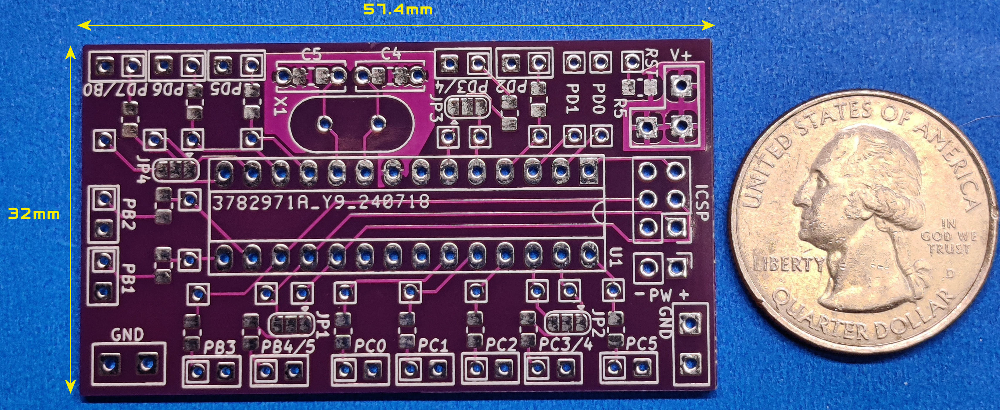
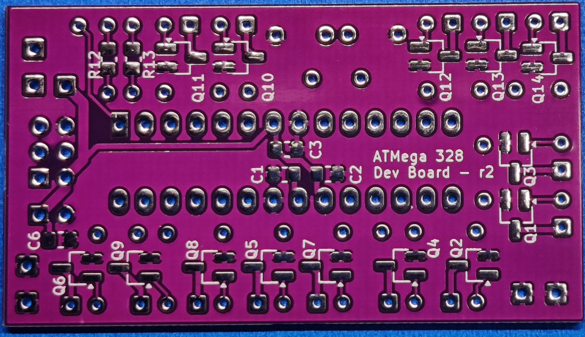

# ATMega 328 Development Board

Here is the documentation and support files for building and using the ATMega 328 Development PCB. 
To assemble this circuit board you must be comfortable soldering surface mounted parts as small as 0805.
A full assembly and usage guide is available in the "docs" folder.
 
[See My YouTube Channel for examples on assembling this type of board](https://www.youtube.com/@Johnny_Electronic/playlists)

## This build will use the following components in the design:

*Dimensions: 57.4 x 32 mm*
*Parts Supported: ATMega 44 / 88 / 168 / 328*
*Up to 14 MOSFET or BJT drivers supported*
*Programming using the ICSP port or directly to the removed part*
*Various 0805 resistors and capacitors*

The ATMega 328 development board supports the ATMega44/88/168/328 28 pin through hole (TH) parts although the 328 is probably the only one easily available. Connections to all IO pins are provided as well as a sub set of connections through SMD resistors and MOSFET drivers. A total of 14 MOSFET transistors are available or optionally a bipolar junction transistor (BJT) can be used. Some outputs share a MOSFET and the output pin can be selected by a solder jumper (JP1-4). Resistor pads are available for the RX and TX lines if needed for serial communication or they can be used for general IO. See the IO Pin Connection Planning Guide at the end of this document for details.

A dedicated power connection is provided (PW) and other connection areas are marked as power (V+) and ground (GND) for sourcing other components. The power supply range is determined by the selection of U1, typically 1.8-5.5 volts. However, support for the 16 Mhz crystal requires a minimum of 4.5 volts although I've used it as low as 3.7 volts. If you need to use lower voltages you may need to look at running the device at a lower frequency.

Programming can be accomplished using a chip programmer for the ATMega part or using the In-Circuit Serial Programming (ICSP) port to program the mounted part on the board. I also have available a soft touch ICSP programming cable (No ICSP socket needed) that can be used with an Arduino UNO or NANO type of device as the programmer. You can also optionally use a 28-pin socket and then remove the part for programming. There are many YouTube videos on Arduino programming options.

This board was designed to be as small as possible while providing numerous connection options and a set of MOSFET drivers for LED lighting in scale model builds. Typically used in scale model builds, dioramas or other areas where a small compact SoC (System on a chip) is needed.

## Directories
- schematics: Images of the schematic design
- doc: Documents, PCB Build document 
- img: Images for various documents

