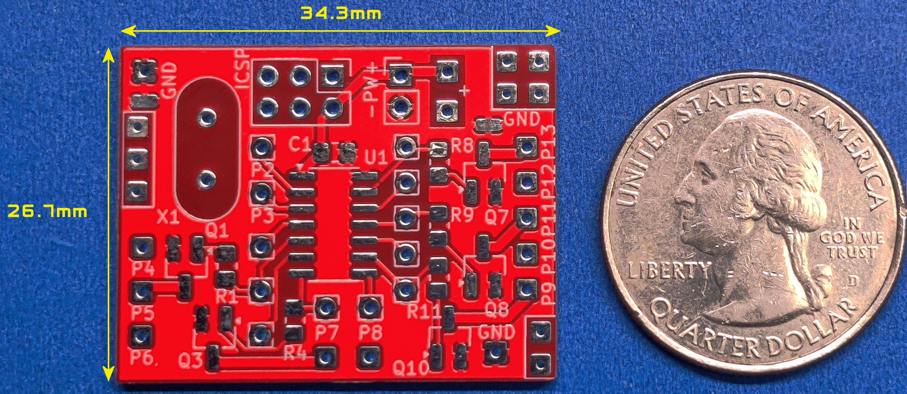
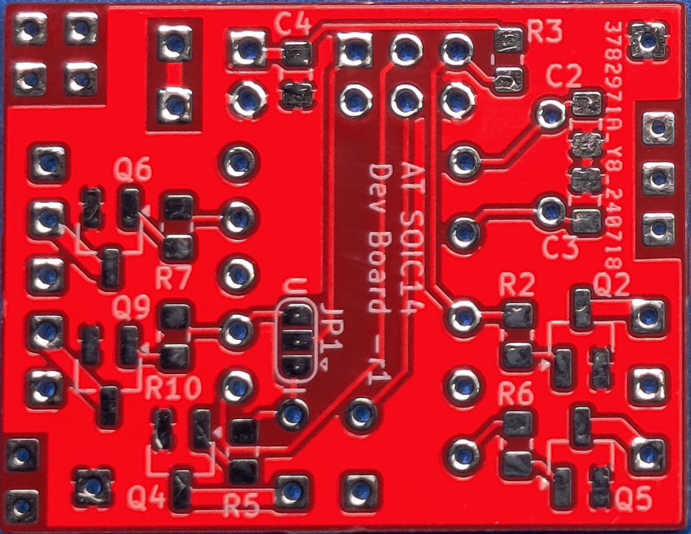

# AT SOIC14 Development Board

Here is the documentation and support files for building and using the AT SOIC14 Development PCB. 
To assemble this circuit board you must be comfortable soldering surface mounted parts as small as 0805.
A full assembly and usage guide is available in the "docs" folder.
 
[See My YouTube Channel for examples on assembling these dev boards](https://www.youtube.com/@Johnny_Electronic/playlists)

## This build will use the following components in the design:

*Dimensions: 34.3 x 26.7 mm*
*Parts Supported: VDD pin 1, GND pin 14. Designed for the ATtiny 24/84 series but supports others*
*  ICSP/SPI Programming (External crystal option on 84 series):*
*    ATTiny 24, 44, 84, 441, 841*
*  UPDI pin 10 Programming (No external crystal support):*
*    ATTiny (tinyAVR Series-2) 424, 824, 1624, 3224*
*    ATTiny (tinyAVR Series-0) 1604, 804, 404, 204*
*    ATTiny (tinyAVR Series-1) 1614, 814, 414, 214*
*Up to 10 MOSFET or BJT drivers supported*
*Programming using the ICSP/UPDI port*
*Various 0805 resistors and capacitors*

The AT SOIC14 development board supports a variety of 14 pin SMD parts with ICSP or UPDI programming options (See the Board Details for a list of devices). Generally, those parts in a SOIC14 narrow package with VDD at pin 1, GND at Pin 14, and UPDI on pin 10 or ICSP should work.  

Connections to all IO pins are provided (Referenced P2-P13) as well as a sub set of connections through SMD resistors and MOSFET drivers. A total of 10 MOSFET transistors are available or optionally a bipolar junction transistor (BJT) can be used. The only outputs that do not have a transistor option are Pins 2 & 3. See the IO Pin Connection Planning Guide at the end of this document for details.

A dedicated power connection is provided (PW) and other connection areas are marked as power (V+) and ground (GND) for sourcing other components. The power supply range is determined by the selection of U1, typically 2.7-5.5 volts. 

Programming can be accomplished using the In-Circuit Serial Programming (ICSP) port to program the mounted part on the board. There is a jumper option to select either ICSP or UPDI mode. I also have available soft touch programming cables for either mode (No ICSP socket needed). There are many YouTube videos on Arduino programming options.

This board was designed to be as small as possible while providing numerous connection options and a set of MOSFET drivers for LED lighting in scale model builds. Typically used in scale model builds, dioramas or other areas where a small compact SoC (System on a chip) is needed.

## Directories
- schematics: Images of the schematic design
- doc: Documents, PCB Build document 
- img: Images for various documents

