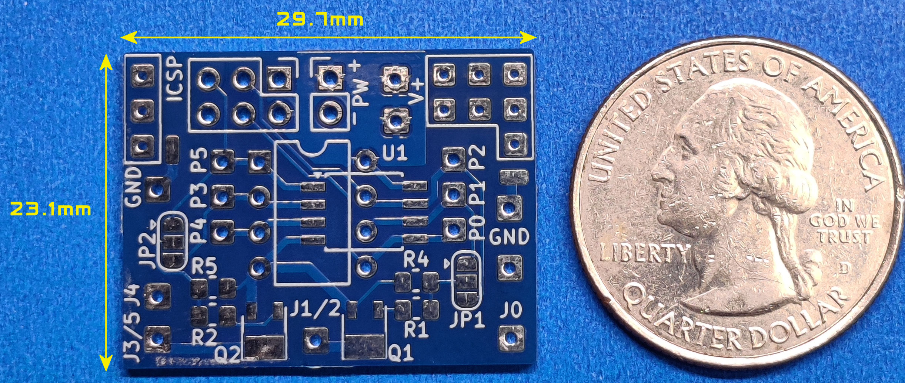
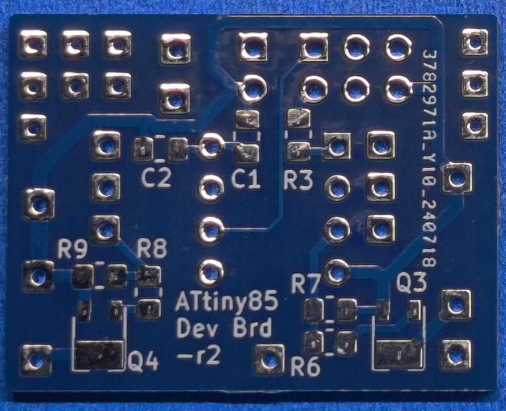

# ATtiny85 Development Board

Here is the documentation and support files for building and using the ATtiny85 Development PCB. 
To assemble this circuit board you must be comfortable soldering surface mounted parts as small as 0805.
A full assembly and usage guide is available in the "docs" folder.

> [!NOTE]
> [See My YouTube Channel for examples on programming my development boards with these cables](https://www.youtube.com/@Johnny_Electronic/playlists)

## Technical Details

* Dimensions: 29.7 x 23.1 mm
* Parts Supported: ATtiny 25 / 45 / 85 (SMD or Through hole)
* Up to 4 MOSFET or BJT drivers supported
* Programming using the ICSP port or directly to the removed part (Non-SMD version)
* Various 0805 resistors and capacitors

The ATtiny85 development board supports the ATtiny 25/45/85 8 pin through hole (TH) or surface mount (SMD) parts. Connections to all IO pins are provided as well as a sub set of connections through SMD resistors and MOSFET drivers. A total of 4 MOSFET transistors are available or optionally a bipolar junction transistor (BJT) can be used. Some outputs share a MOSFET and the output pin can be selected by a solder jumper (JP1-2). See the IO Pin Connection Planning Guide at the end of this document for details.

A dedicated power connection is provided (PW) and other connection areas are marked as power (V+) and ground (GND) for sourcing other components. The power supply range is determined by the selection of U1, typically 2.7-5.5 volts or lower if using the low voltage parts.

Programming can be accomplished using a chip programmer for the AT part or using the In-Circuit Serial Programming (ICSP) port to program the mounted part on the board. I also have available a soft touch ICSP programming cable (No ICSP socket needed) that can be used with an Arduino UNO or NANO type of device as the programmer. You can also optionally use an 8-pin socket (If using a TH part) and then remove the part for programming. There are many YouTube videos on Arduino programming options.

This board was designed to be as small as possible while providing numerous connection options and a set of MOSFET drivers for LED lighting in scale model builds. Typically used in scale model builds, dioramas or other areas where a small compact SoC (System on a chip) is needed.

## Purchasing
[Visit my Tindie Store](https://www.tindie.com/stores/johnnyelectronic/)

## Directories

-[Schematics](schematics/)

-[Documents](doc/)

-[Images](img/)

## Licensing

This work is licensed under Creative Commons Attribution-ShareAlike 4.0 International. 
To view a copy of this license, visit [https://creativecommons.org/licenses/by-sa/4.0/](https://creativecommons.org/licenses/by-sa/4.0/)

Distributed as-is; no warranty is given.

