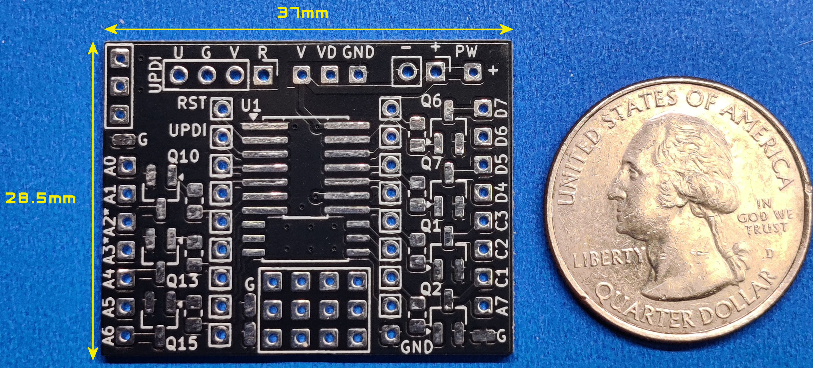
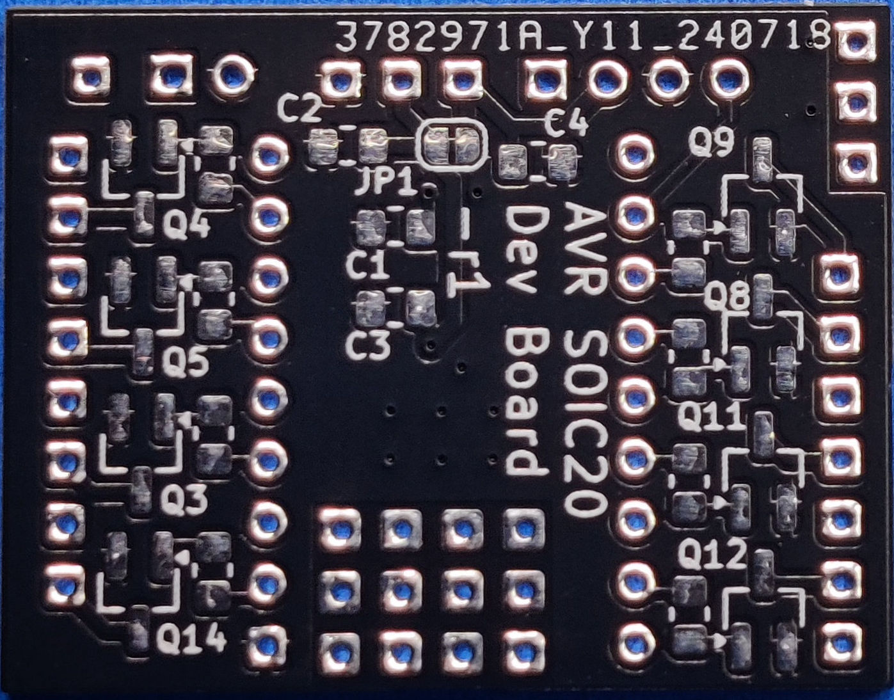
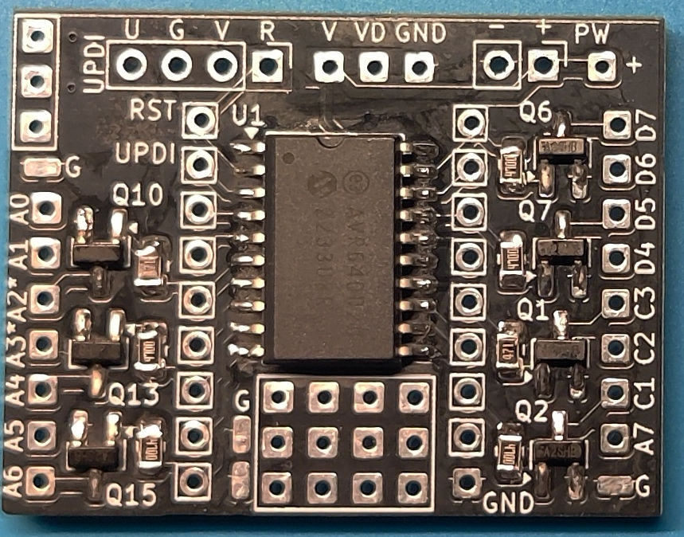
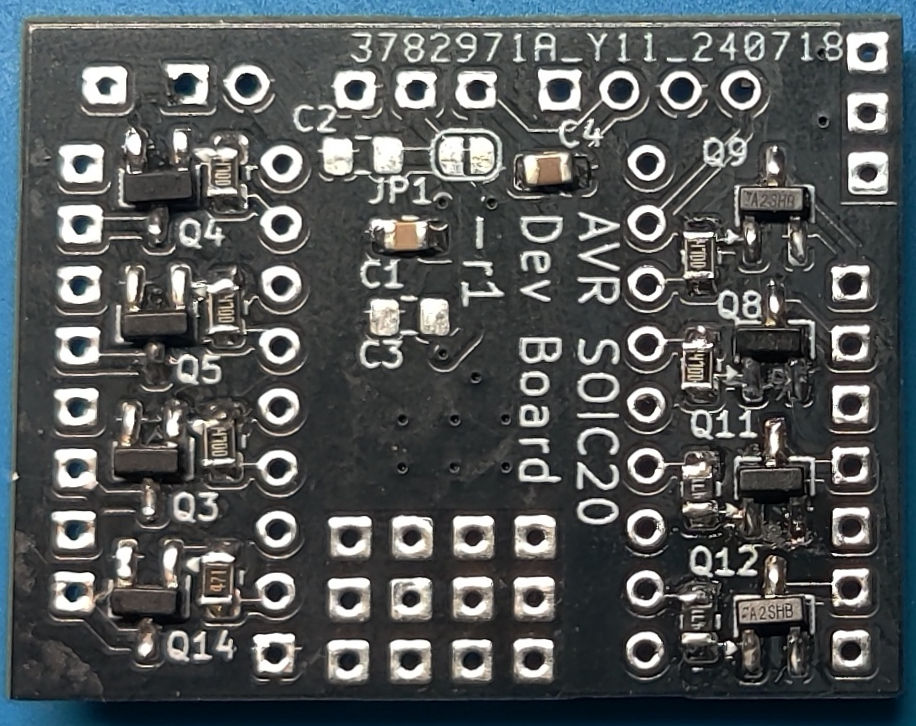

# AVR SOIC20 Development Board

__Assembled Boards - Top/Bottom (With AVR64DD20 part)__

 

Here is the documentation and support files for building and using the AVR SOIC20 Development PCB. 
To assemble this circuit board you must be comfortable soldering surface mounted parts as small as 0805.
A full assembly and usage guide is available in the "doc" folder.

> [!NOTE]
> [See My YouTube Channel for examples on programming my development boards with these cables](https://www.youtube.com/@Johnny_Electronic/playlists)

## Technical Details

* Dimensions: 37 x 28.5 mm
* Parts Supported:
   - Designed for the AVR DD series with 14 pin SOIC narrow or 20 pin SOIC wide package, VDD pin 14/20, VDD2 pin 9/15, GND pin 1
     - UPDI pin 3 Programming
     - AVR16DD14/20, AVR32DD14/20, AVR64DD14/20 (SMD)
* Support for a separate VDDIO2 available
* Up to 15 MOSFET or BJT drivers supported with 20 pin packages or 9 with the 14 pin packages
* Programming using the UPDI port
* Various 0805 resistors and capacitors

The AT SOIC20 development board supports a variety of AVR DD Series 14 and 20 pin SMD parts with a UPDI programming option (See the Board Details for a list of devices). The SOIC14 parts are in a narrow package with VDD on pin 14, GND on Pin 1, and the UPDI on pin 3. The SOIC20 parts are a wide package with VDD on pin 20, GND on Pin 1, and the UPDI on pin 3.

Connections to all IO pins are provided (Referenced as RST, UPDI, An/Cn/Dn)) as well as a sub set of connections through SMD resistors and MOSFET drivers. A total of 15 MOSFET transistors are available for the 20-pin package or optionally a bipolar junction transistor (BJT) can be used. For the 14-pin package up to 9 transistors are available. The only outputs that do not have a transistor option are Pins 2 & 3. See the IO Pin Connection Planning Guide at the end of this document for details.

A dedicated power connection is provided (PW) and other connection areas are marked as power (+) and ground (GND/G) for sourcing other components. The power supply range is determined by the selection of U1, typically 1.8-5.5 volts. 

The IO outputs are setup to support 2.54mm pin strip headers so that the board can be used in breadboarding a design. Programming can be accomplished using the UPDI header to program the mounted part on the board. I also have available a soft touch programming cable (No UPDI socket needed). There are many YouTube videos on Arduino programming options and I discuss my favorite in the UPDI Header section.

This board was designed to be as small as possible while providing numerous connection options and a set of MOSFET drivers for LED lighting in scale model builds. Typically used in scale model builds, dioramas or other areas where a small compact SoC (System on a chip) is needed.

## Purchasing
[Visit my Tindie Store](https://www.tindie.com/stores/johnnyelectronic/)

## Directories

-[Schematics](schematics/)

-[Documents](doc/)

-[Images](img/)

## Licensing

This work is licensed under Creative Commons Attribution-ShareAlike 4.0 International. 
To view a copy of this license, visit [https://creativecommons.org/licenses/by-sa/4.0/](https://creativecommons.org/licenses/by-sa/4.0/)

Distributed as-is; no warranty is given.

