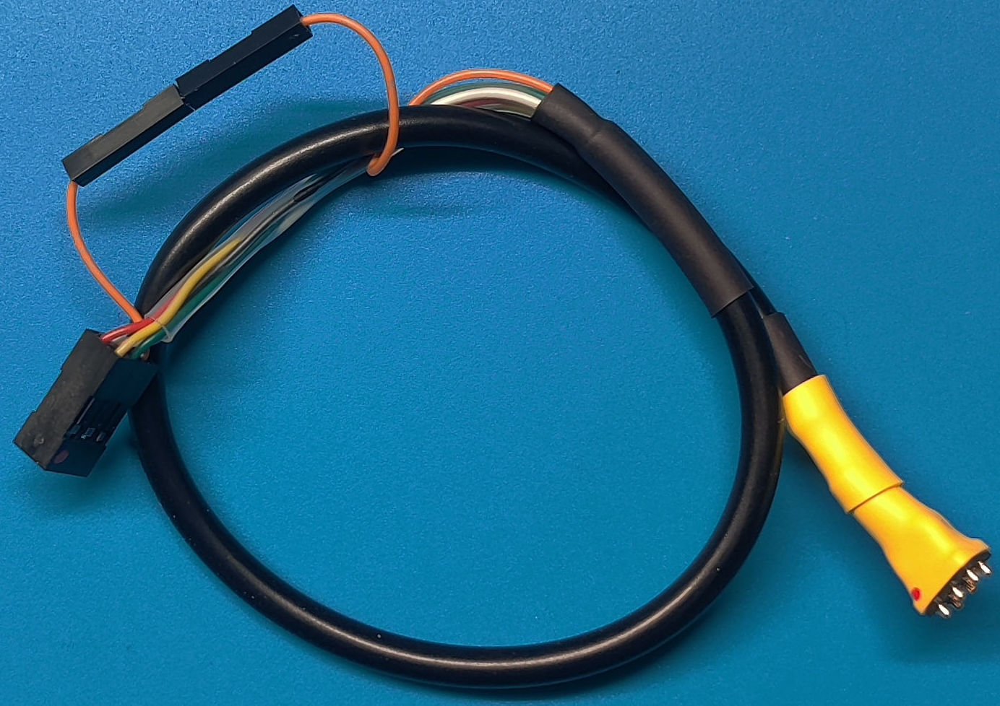
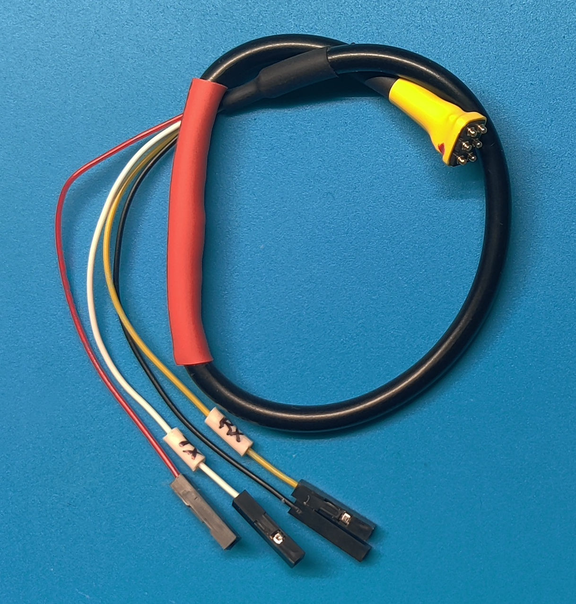
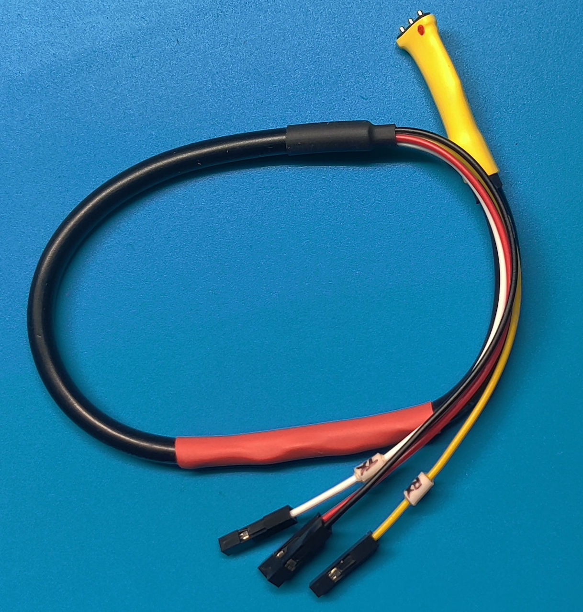
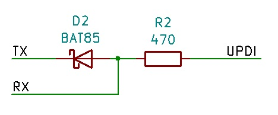

# Arduino Development Board Programming Cables

## ICSP 6-pin ST Programming Cable

This is a ICSP programming cable for the older 6-pin Arduino ICSP. It uses a spring loaded soft-touch (ST) 6-pin header that only needs to touch the ICSP pad for programming. 

The other end connects to a 6-pin ICSP header from a ISP programmer such as an Arduino Uno or Nano. You will either need to modify the reset line to connect to D10 at the ICSP header or separate the orange pins and connect it directly to the D10 output.

[schematic](schematics/ICSP_6Wire.pdf)

## UPDI 6-pin ST Programming Cable

This is a UPDI programming cable for the newer AVR parts. It uses a spring loaded soft-touch (ST) 6-pin header that only needs to touch the ICSP pad for programming. 

This only works with ISCP pads that can be configured for Pin 1 to be used for a UPDI connection.

The other end connects to 4 single pin dupont headers that are used to connect to a USB to serial converter such as CH340 types. The cable has a Schottky diode and resistor included. This cable has been tested with CH340E and CH9340C USB to Serial converters. Others may work as well or need further resistor modifications.

[schematic](schematics/UPDI_6wire.pdf)

## UPDI 3-pin ST Programming Cable

This is a UPDI programming cable for the newer AVR parts. It uses a spring loaded soft-touch (ST) 3-pin header that only needs to touch the UPDI pad for programming. 

This only uses pin 2-4 of the UPDI 4 pin pad. The pin 1 Reset line is not used. 

The other end connects to 4 single pin dupont headers that are used to connect to a USB to serial converter such as CH340 types. The cable has a Schottky diode and resistor included. This cable has been tested with CH340E and CH9340C USB to Serial converters. Others may work as well or need further resistor modifications.

[schematic](schematics/UPDI_3wire.pdf)

## Purchasing
[Visit my Tindie Store] (https://www.tindie.com/stores/johnnyelectronic/)

> [!NOTE]
> [See My YouTube Channel for examples on programming my development boards with these cables](https://www.youtube.com/@Johnny_Electronic)

## Directories
- [schematics](schematics/)
- [images](img/)

## Licensing

This work is licensed under Creative Commons Attribution-ShareAlike 4.0 International. 
To view a copy of this license, visit [https://creativecommons.org/licenses/by-sa/4.0/](https://creativecommons.org/licenses/by-sa/4.0/)

Distributed as-is; no warranty is given.

