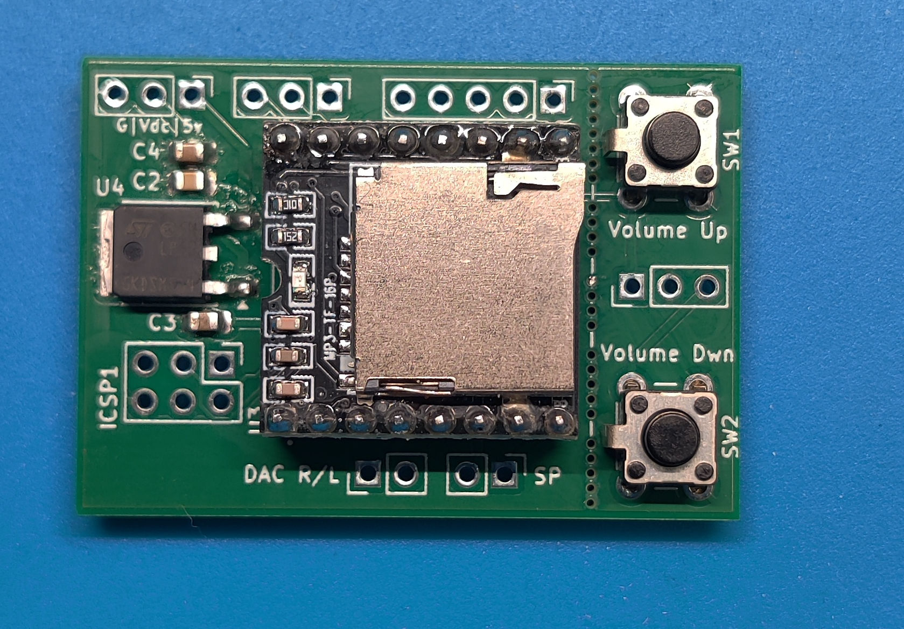

# DFPlayer Board and Review Files

 

**Here is the documentation for the DFPlayer Review as well as the DFPlayer Mini Board.**

# DFPlayer Review
Documentation and support files for the DFPlayer Review video. 

-[DFPlayer Review Folder](DFPlayer_Review/)

# DFPlayer Mini Board - Blank PCB or Assembled

DFPlayer Board
To assemble this circuit board you must be comfortable soldering surface mounted parts as small as 0805.
A assembly guide is available in the "doc" folder.
 
> [!NOTE]
> [See My YouTube Channel for DFPlayer Review as well as a assembly video on this board](https://www.youtube.com/@Johnny_Electronic/)

## Technical Details
* Dimensions: 44.5 x 31 mm
* Supports either SOIC8 or DIP8 ATTiny85 package
* ICSP Programming Interface
* DFPlayer or MP3-TF-16P MP3 module
* ATTiny connected to DFP serial TX/RX or RX/Busy
* Cut away volume switch board.
    - Volume up/down switches on the board, can be removed if not needed or relocated.
* Pin connections for:
    - 3 spare ATTiny outputs
    - DFP Volume Up/Down, IO, ADKEY 
    - DAC R/L
    - Speaker
    - 5v regulator for using other voltage supply's

## **Description**
The DFPlayer Mini Board is a small compact self contained PCB with a DFPlayer mini or MP3-TF-16P MP3 module, a ATTiny 85 controller, voltage regulator and volume switches. It is great for adding audio to scale model projects, Halloween displays or anything else you can think of.

Two of the ATtiny IO lines are used for interfacing with the DFPlayer. You can use a full serial connection or just send commands to the DFPlayer and monitor the busy line. This leaves pins 2,6, and 7 for external IO to further control the DFPlayer.  

Additional IO connections for the DFPlayer include IO, ADKEY, Volume Up/Down (Using the IO pins), DAC L/R and a Speaker connection. Connections can be soldered to the board or 0.1" headers can be used.

A schematic is available along with a Bill of Materials (BOM). 

Check out the documentation link for more details.

## Purchasing blank PCB or assembled boards

## Directories

-[Schematics](sch/)

-[Documents](doc/)

-[Images](img/)

-[Source Files](src/)

## Licensing

This work is licensed under Creative Commons Attribution-ShareAlike 4.0 International. 
To view a copy of this license, visit [https://creativecommons.org/licenses/by-sa/4.0/](https://creativecommons.org/licenses/by-sa/4.0/)

Distributed as-is; no warranty is given.

