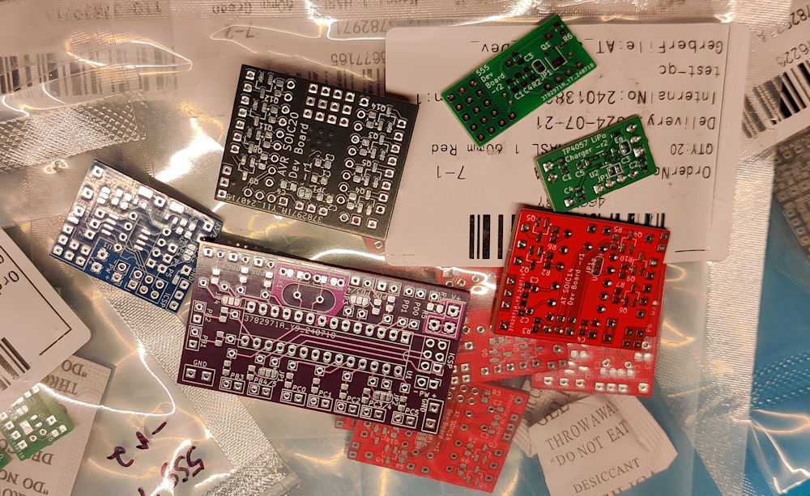

# Arduino Development Boards and Programming Cables

## AT/AVR/Arduino Boards

- [ATtiny85 8 pin SMD/TH Board](ATtiny85/)
- [AT Mega 328 28 pin TH Board](ATMega328/)
- [AT SOIC14 14 pin SMD ICSP/UPDI Board](AT_SOIC14/)
- [AVR SOIC20 14 pin and 20 pin SMD UPDI Board](AVR_SOIC20/)

## Lipo Battery Charger
- [TP4057 Lipo Battery Charger Board](TP4057_Lipo_Charger/)

## Cables
- [Programming Cables](Cables/)

These boards are designed to be as small as possible while providing numerous connection options and a set of MOSFET drivers for LED lighting in scale model builds. Typically used in scale model builds, dioramas or other areas where a small compact SoC (System on a chip) is needed.

> [!NOTE]
> [See My YouTube Channel for examples on programming my development boards with these cables](https://www.youtube.com/@Johnny_Electronic)

__Licensing__

This work is licensed under Creative Commons Attribution-ShareAlike 4.0 International. 
To view a copy of this license, visit [https://creativecommons.org/licenses/by-sa/4.0/](https://creativecommons.org/licenses/by-sa/4.0/)

Distributed as-is; no warranty is given.

