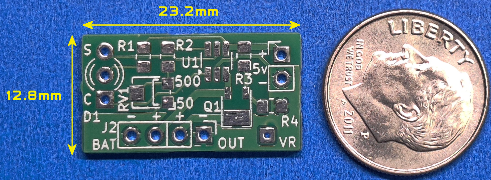
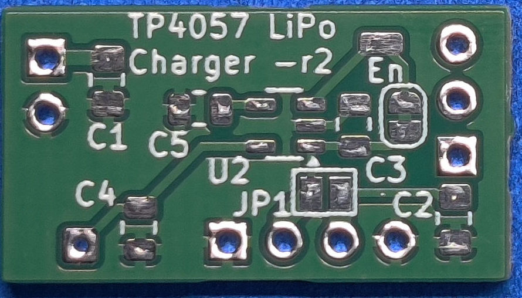

# TP4057 Lipo Charger Board

The TP4057 Lipo Battery Charger Board is used to charge various lithium polymer or "Lipo"� batteries. It supports single-cell lithium-ion or lithium polymer batteries and has an adjustable current setting from 50ma to 500 ma (RV1 can be bypassed and fixed resistor values for R2 can be used instead to set the charging current). This works great for most of the batteries needed for smaller projects easily up to 1 amp if needed. The board uses a common anode dual color LED to show the charging/standby states. 

The LED can either be mounted on the board or wired off board as needed. You can also use two individual LED's if you want. Connections to BAT IN, OUT, and 5v are at a 2.54 mm pitch supporting various headers, plugs, and sockets. 5v is used as the input voltage to charge the battery. A USB power source works well for this. I've made a custom 3 pin charging cable from an old USB cord to charge most of my models. Q1 is used to disconnect the output side while the battery is charging but this can be bypassed with JP1 if needed.

The back of the board has support for an optional low current voltage regulator. This fits either an SOT-23.5 or SOT-25 package of which there are a few types. Useful for driving some of the color displays that require a 3.3 voltage supply.

This board was designed to be as small as possible while providing a few options for battery charging and voltage regulation. Typically used in scale model builds, dioramas or other areas where a small compact lipo battery charger is needed.

A full assembly, usage guide, and schmatic are available in the "Documents" and "Schematics" folder. To assemble this circuit board you must be comfortable soldering surface mounted parts as small as 0805.
 
> [!NOTE]
> [See My YouTube Channel for examples on programming my development boards with these cables](https://www.youtube.com/@Johnny_Electronic/playlists)

## Technical Details

* TP4057 Lipo Charger IC, 50-500ma (SMD)
* Various 0805 resistors and capacitors
* Optional SOT23.5/25 LDO Voltage Regulator

## Purchasing
[Visit my Tindie Store](https://www.tindie.com/stores/johnnyelectronic/)

## Directories

-[Schematics](schematics/)

-[Documents](doc/)

-[Images](img/)

## Licensing

This work is licensed under Creative Commons Attribution-ShareAlike 4.0 International. 
To view a copy of this license, visit [https://creativecommons.org/licenses/by-sa/4.0/](https://creativecommons.org/licenses/by-sa/4.0/)

Distributed as-is; no warranty is given.

